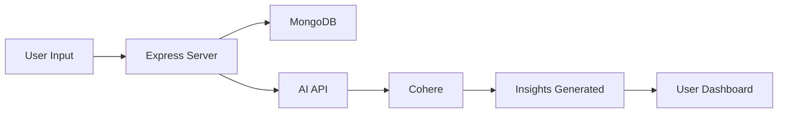
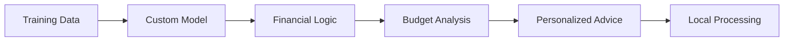

# 🧠 RukiAI – Smart Personal Finance Tracker

<div align="center">


[](https://choosealicense.com/licenses/mit/)
[](https://nodejs.org/)
[](https://www.mongodb.com/)
[](https://openai.com/)

</div>

---

## 💡 Project Overview

**Managing money shouldn't be confusing — that's where RukiAI steps in.**

RukiAI is a full-stack, AI-enhanced personal finance tracker designed to help users make better financial decisions through real-time insights, budget monitoring, and goal tracking. Whether you're a student, a working professional, or a retiree, RukiAI personalizes your dashboard to give meaningful suggestions about your spending, saving, and financial health.

### 🌟 What RukiAI Does

<table>
<tr>
<td width="50%">

**📊 Smart Expense Tracking**
- Log daily or weekly expenses
- Automatic categorization
- Receipt scanning (coming soon)

**🎯 Goal Setting & Monitoring**
- Set custom budgets and financial goals
- Track progress with visual indicators
- Milestone celebrations

</td>
<td width="50%">

**🤖 AI-Powered Insights**
- Real-time spending analysis
- Personalized financial advice
- Predictive budgeting

**📧 Smart Notifications**
- Weekly reports via email or SMS
- Budget alerts and warnings
- Achievement notifications

</td>
</tr>
</table>

### 💬 AI-Powered Suggestions Examples

> 💡 *"You've already used 70% of your food budget this week."*
> 
> 🎉 *"You're on track to hit your emergency savings goal ahead of schedule."*
> 
> ⚠️ *"Your entertainment spending is 40% higher than last month."*

---

## ⚙️ Technology Stack

<div align="center">

| **Backend** | **Database** | **Frontend** | **AI Integration** | **Templating** |
|-------------|--------------|--------------|-------------------|----------------|
|  |  |  | ! |  |
| Express Framework | Document Storage | CSS3 + EJS Templates | API Integration | Server-Side Rendering |

</div>

---

## 🧩 AI System: Two-Part Architecture

This project is structured in two phases, designed for both cost-effective deployment and technical showcase:

### 🔗 Phase 1: Live & Deployable Version 



This version is built to be **lightweight, scalable, and affordable** for deployment. Instead of hosting a custom model — which would require expensive compute resources — this version leverages external AI APIs (like Cohere) to process user expense data and generate personalized insights.

#### 💼 Why AI API?

<table>
<tr>
<td>

✅ **Minimal hosting cost** (ideal for small projects)  
✅ **Faster deployment**  
✅ **High-quality NLP insights** out of the box  
✅ **Scalable architecture**  
✅ **Production-ready**

</td>
<td>

```javascript
// Example AI Integration
const getAIAdvice = async u => {
  try {
    const p = await generatePrompt(u);
    const r = p && await cohere.generate(
    { 
      model: 'command-r-plus', 
      prompt: p, maxTokens: 300, 
      temperature: 0.9 
    });
    return r?
    .generations?
    .[0]?.text?
    .trim() || 'Unable to generate advice.';
  } catch {
    return 
    'Unable to generate financial advice. Try again later.';
  }
};
```

</td>
</tr>
</table>

**✅ Status:** This is the version intended for public use, hosted and live.

---

### 🧠 Phase 2: Local AI Model 



The second part of this project includes a **custom-built AI model** designed to simulate financial coaching and budget guidance. This version is not deployed online but is included in the repository to demonstrate advanced technical skills.

#### 💼 Why Include a Local AI Model?

| Purpose | Benefit |
|---------|---------|
| 🎯 **Skill Showcase** | Demonstrate capability to design, train, and integrate AI models |
| 👥 **Recruiter Review** | Allow collaborators to review the model logic and architecture |
| 🚀 **Production Simulation** | Show how a self-hosted intelligent system would work at scale |
| 🔒 **Data Privacy** | Complete local processing for sensitive financial data |

> **🚫 Important Note:** This version is NOT intended for deployment, as self-hosted models can be resource-intensive without a paid server or GPU support.
> 
> 📁 **Location:** Model training, logic, and examples are located in `/ai-model/` directory.

---

## 🎯 Target Audience

<div align="center">

<table>
<tr>
<td align="center" width="25%">

### 🧑‍🎓 Students
**Track Financial Growth**
- Monthly allowance management
- Education expense tracking
- Lifestyle spending analysis
- Budget learning tools

</td>
<td align="center" width="25%">

### 👨‍💼 Professionals
**Career-Focused Finance**
- Salary optimization
- Investment tracking
- Rent & utilities monitoring
- Retirement planning

</td>
<td align="center" width="25%">

### 👵 Retirees
**Fixed Income Management**
- Pension planning
- Medical cost tracking
- Fixed budget optimization
- Healthcare savings

</td>
<td align="center" width="25%">

### 👤 Guest Users
**Try Before Commit**
- Demo mode access
- Feature exploration
- No signup required
- Sample data testing

</td>
</tr>
</table>

</div>

---

## 🚀 Roadmap & Future Features

<details>
<summary><b>🗺️ Click to view our development roadmap</b></summary>

### 📊 Phase 3: Visual Dashboards & Analytics
- **Interactive Charts & Graphs**
  - Spending trend visualization
  - Income vs expense comparisons
  - Category-wise breakdowns
  - Monthly/yearly financial health reports
- **Advanced Analytics**
  - Predictive spending models
  - Seasonal expense patterns
  - Financial goal probability tracking

### 🎤 Phase 4: Voice & Conversational Interface
- **Voice-Based Expense Logging**
  - "Hey RukiAI, I spent $15 on lunch"
  - Natural language processing
  - Multi-language support
- **AI Chatbot Integration**
  - Real-time financial Q&A
  - Budget consultation chat
  - Expense categorization assistance

### 📱 Phase 5: Mobile-First Experience
- **Progressive Web App (PWA)**
  - Offline functionality
  - Push notifications
  - Native app experience
- **Mobile Features**
  - Camera receipt scanning
  - Location-based expense tracking
  - Quick expense shortcuts

### ☁️ Phase 6: Advanced AI Deployment
- **Google Cloud Platform Integration**
  - Custom model deployment
  - Scalable AI infrastructure
  - Enhanced data processing
- **Machine Learning Pipeline**
  - Continuous model improvement
  - A/B testing for AI suggestions
  - Personalized financial coaching

</details>

---

## 🛠️ Installation & Setup

<details>
<summary><b>🚀 Quick Start Guide</b></summary>

### Prerequisites
- Node.js (v18 or higher)
- MongoDB (local or cloud instance)
- Cohere API key (for AI features)

### Installation Steps

1. **Clone the repository**
   ```bash
   git clone https://github.com/yourusername/rukiai.git
   cd rukiai
   ```

2. **Install dependencies**
   ```bash
   npm install
   ```

3. **Environment setup**
   ```bash
   cp .env.example .env
   # Edit .env with your configuration
   ```

4. **Start the application**
   ```bash
   npm run dev
   ```

5. **Access the app**
   Open `http://localhost:3000` in your browser

</details>

---

## 📸 Screenshots & Demo

<div align="center">

| Dashboard | Expense Tracking | AI Insights |
|-----------|------------------|-------------|
|  |  |  |

[🎥 **Watch Demo Video**](https://your-demo-link.com) | [🌐 **Live Demo**](https://your-live-demo.com) | [📱 **Mobile View**](https://your-mobile-demo.com)

</div>

---

## 🤝 Contributing

We welcome contributions! Here's how you can help:

- 🐛 **Report Bugs:** Open an issue with bug details
- 💡 **Suggest Features:** Share your ideas for new features
- 🔧 **Submit PRs:** Help us improve the codebase
- 📖 **Improve Docs:** Help us make documentation better

See our [Contributing Guidelines](CONTRIBUTING.md) for more details.

---

## 📄 License

This project is licensed under the MIT License - see the [LICENSE](LICENSE) file for details.

---

## 👨‍💻 About the Developer

<div align="center">

**Built with ❤️ for better financial health**

[](https://github.com/M0rs-Ruki)
[](https://www.linkedin.com/in/anup-pradhan-434bba313/)
[](http://morscode.site/)

</div>

---

<div align="center">

### ⭐ If you found RukiAI helpful, please give it a star!


</div>
